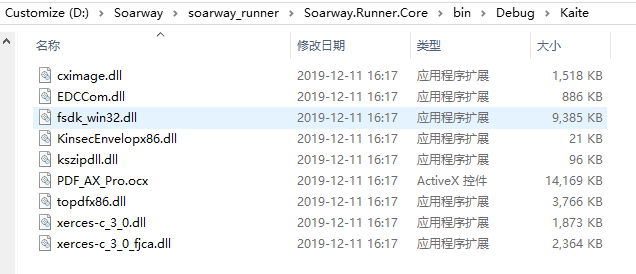

[Edc转Pdf程序下载地址](../Edc转Pdf/Soarway.Runner.Core_v1.0.0.zip)

> 程序运行依赖于 .Net Framework 4.0环境

1. 先将程序拷贝到服务器上，并到**Kaite**文件夹下，用*管理员权限*启动命令行，执行如下命令。若无异常提示则表示成功。
   
   > regsvr32 PDF_AX_Pro.ocx

2. 界面上的每一个选项，在对应插PluginConfig下的xml配置文件均能找到与之对应的配置项。可直接修改xml配置后启动程序；也可在程序的界面内修改后保存的xml文件内。

3. 如果后期有需要修改该Edc转Pdf的程序，需要注意，开发及编译时要选择x86平台。且只支持单线程，不支持多线程并发。这是是由凯特信安导致的，他们的开发包不支持x64及多线程。

4. Kaite文件夹内的dll及ocx都由凯特信安提供，涉及的内容更改应联系凯特信安。

